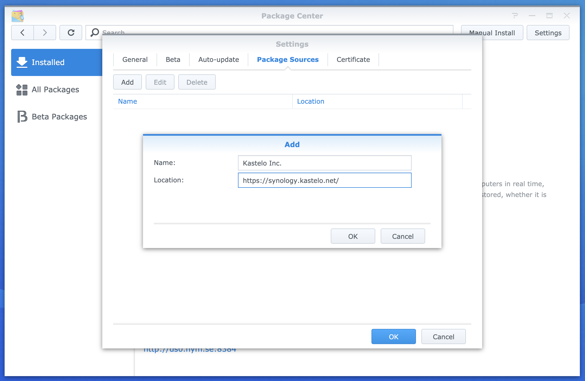
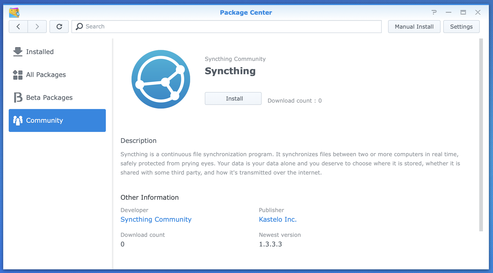
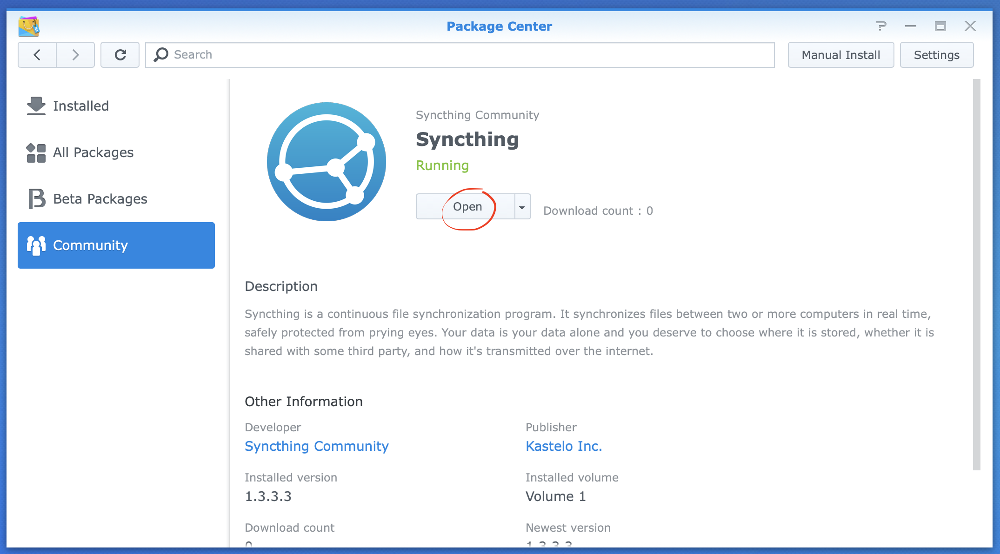
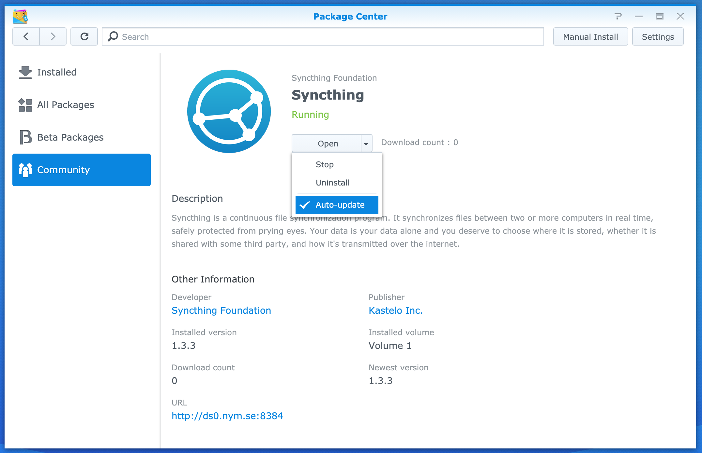

Installing
==========

Adding the Package Source
-------------------------

In the Package Center, Settings, Package Sources, Add the following package
source::

    https://synology.kastelo.net/

It should look something like the following dialog:

Accept the notice about adding the certificate and close the settings
dialog.

Installing the Package
----------------------

There will now be a Community section with a Syncthing package:

Use the Install button here. Syncthing will install and start, at which
point you can visit the Syncthing GUI.

.. note::
    A new shared folder ``syncthing-data`` will have been created during
    installation. This shared folder holds configuration and database
    information that is essential for Syncthing. Do not remove or tamper
    with it.

.. warning::
    Syncthing will by default be available on port 8384 without
    authentication. It's essential that you visit the Syncthing GUI and set
    up authentication in order to protect the integrity of your NAS.

Automatic Updates
-----------------

The package supports automatic upgrades to compatible versions. To enable or
disable automatic updates, use the checkbox in Package Center:

