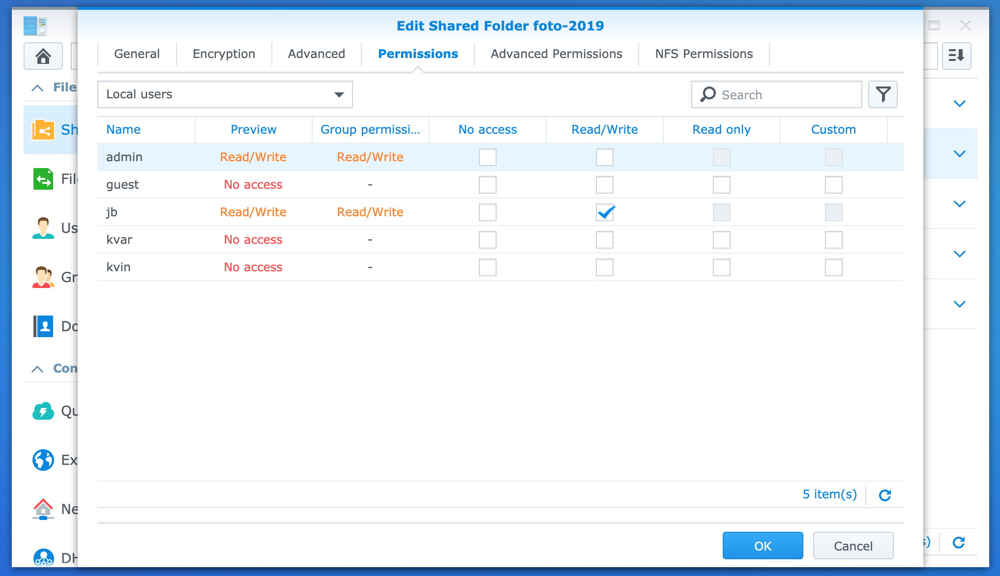
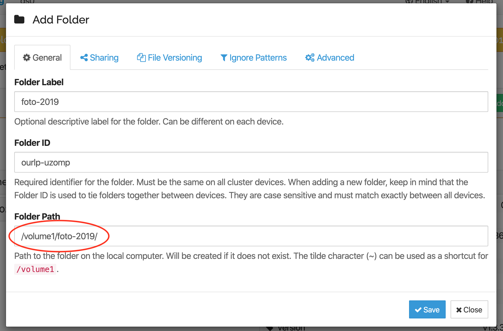
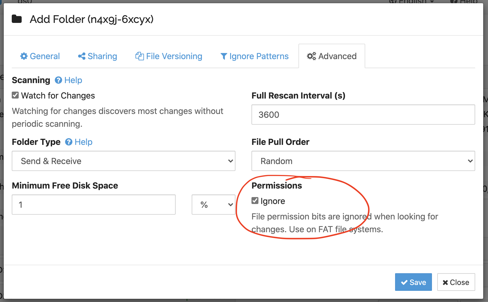
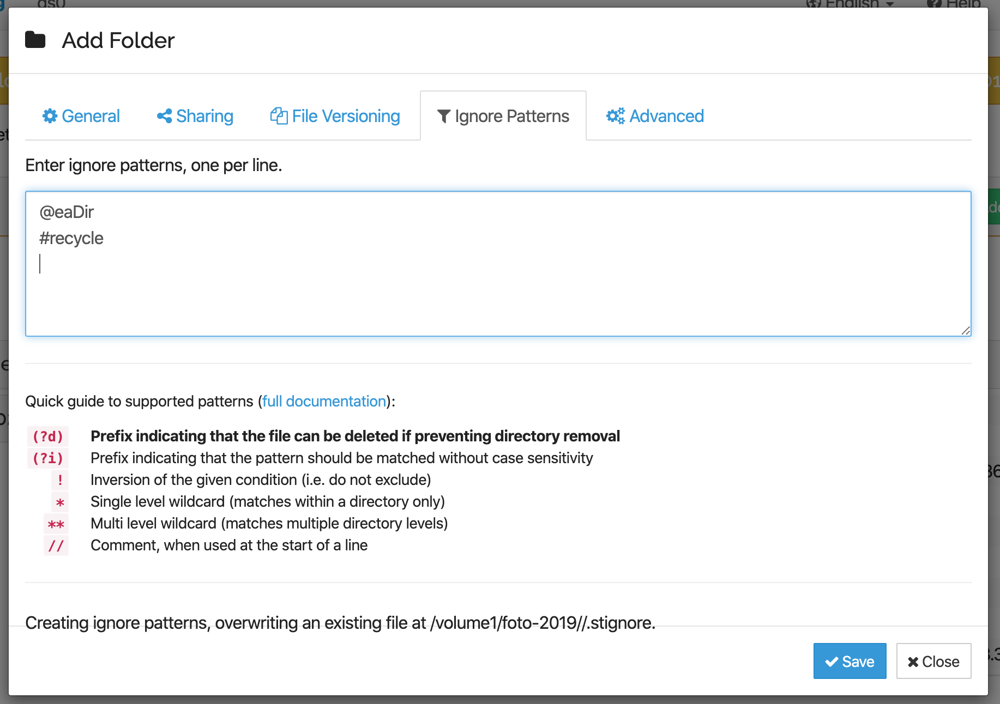

Sharing Folders
===============

Sharing folders works much like on any other computer running Syncthing,
with a couple of caveats.

Synology Permissions
--------------------

Syncthing runs as a system user called ``syncthing.net``, which by default
will not have permission to access any of your file shares. This is
intentional for your security. Hence, in order to share a folder using
Syncthing, the first step is to grant Syncthing access to the file share.

In the Control Panel, select Shared Folders, the folder you want to share,
and Edit. In the Synology folder editor, click the Permissions tab. You
should be here, seeing a list of oridnary users and their access
permissions:

Now select "System internal user" in the dropdown that by default says
"Local users". You will see a different set of users, where
``syncthing.net`` will be one among them. Grant ``syncthing.net`` Read/Write
permissions to the shared folder:

.. image::
    permissions2.png

Click OK to save these settings.

Syncthing Setup & Ignores
-------------------------

You can now add the folder in Syncthing. Syncthing sees the folder at its
physical path, which includes the Synology volume name. If there is only one
volume this will be the default path which Syncthing suggests, but you
should double check:

In order for the Synology ACLs and permissions from above to remain in effect,
it's essential to set the "Ignore Permissions" advanced option in the Syncthing
sharing dialog:

It is also a good idea to set up some initial ignore patterns at the same time.
Synology by default creates a directory ``@eaDir`` that contains some metadata,
and depending on your setup also a recycle bin in ``#recycle`` and a snapshot
dir in ``#snapshot``. These should generally not be synced and ignoring them at
folder creating time will avoid issues down the line:

You can now save the folder, adjust sharing, and so on as usual.

For more information about Syncthing please refer to `the Syncthing
documentation <https://docs.syncthing.net/>`_ or `the Syncthing forum
<https://forum.syncthing.net/>`_.
